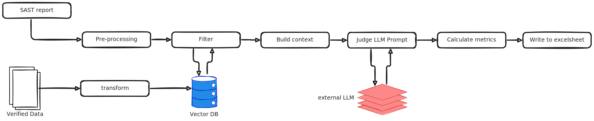

# SAST-AI-Workflow 

## 🎯 Project Overview 
SAST-AI-Workflow is a LLM-based tool designed to detect and flag suspected vulnerabilities through 
SAST(Static Application Security Testing). It inspects suspicious lines of code in a given repository and 
deeply review the legitimacy of errors. This workflow involves existing SAST reports, source code analysis, CWE data 
and other known examples. 

### Purpose
The SAST-AI-Workflow can be integrated into the vulnerability detection process as an AI-assisted tool. It offers 
enhanced insights that may be overlooked during manual verification, while also reducing the time required by engineers.

As an initial step, we applied the workflow to the SAST scanning of the RHEL **systemd** project 
(source: [systemd GitHub](https://github.com/redhat-plumbers/systemd-rhel10)). We intend to extend this approach to support additional 
C-based projects in the future.

## 📐 Architecture 

### Input Sources
- **SAST HTML Reports:**  
  Processes scan results from SAST HTML reports.

- **Source Code:**  
  Pipeline requires to access the exact source code that was used to generate the SAST HTML report.

- **Verified Data:**  
  Incorporates a known error cases for continuous learning & better results.

- **CWE Information:**  
  Embeds additional CWE(Common Weakness Enumeration) data extracted to enrich the context data 
  used for the vulnerability analysis.

### Embeddings & Vector Store
- Converts input data(verified Data, source code) into embeddings using a specialized sentence transformer 
HuggingFace model ([all-mpnet-base-v2](https://huggingface.co/sentence-transformers/all-mpnet-base-v2)) and stores them in a in-memory vector store(FAISS).

### LLM Integration
- Uses NVIDIA's API via the `ChatNVIDIA` integration / uses LLM model deployed on Red Hat Openshift AI platform
to query the vector store and review potential SAST errors.

### Evaluation
- Applies metrics (from Ragas library) to assess the quality of model outputs.

## 📊 Evaluation & Metrics
The evaluations of the model responses are being done using the following metrics:
- **Response Relevancy:**  
  Ensures that the generated answers are directly related to the query.  
  [Response Relevancy](https://docs.ragas.io/en/latest/concepts/metrics/available_metrics/answer_relevance/).
  

## 🔌 Installation & Setup 
Please refer to [how to run](./docs/setup.md) guideline.

